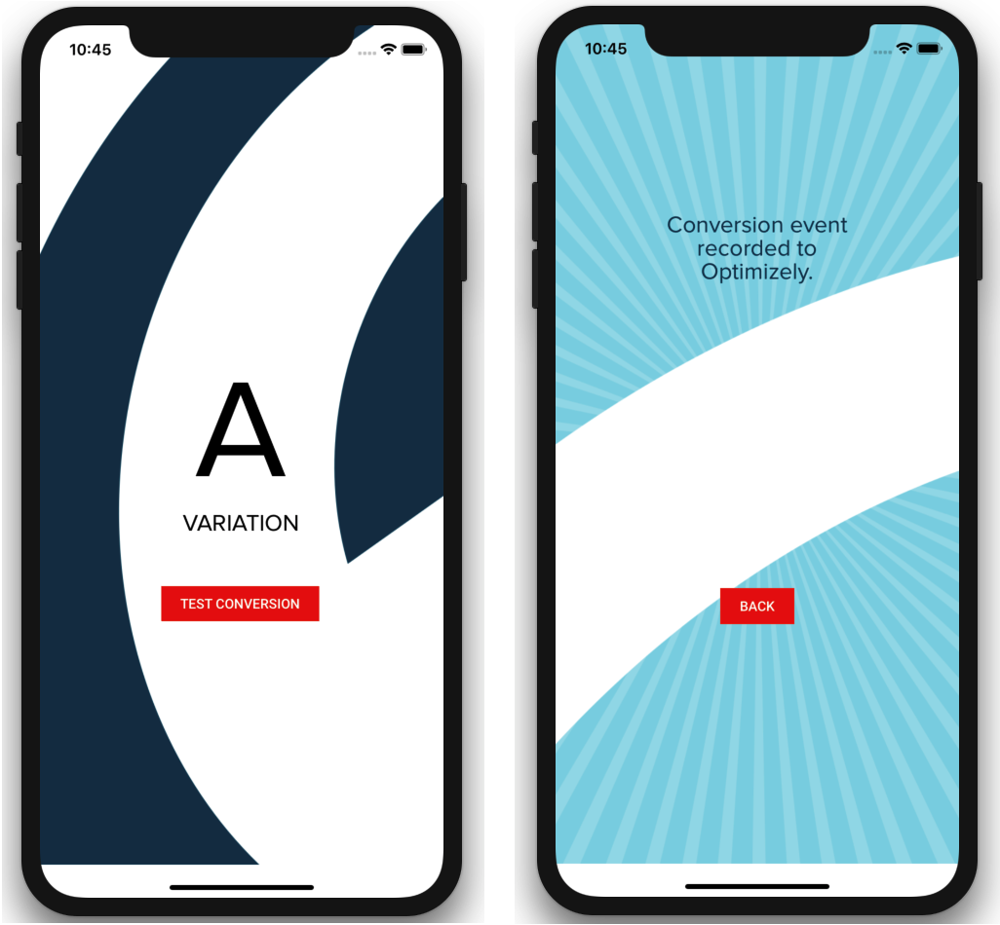
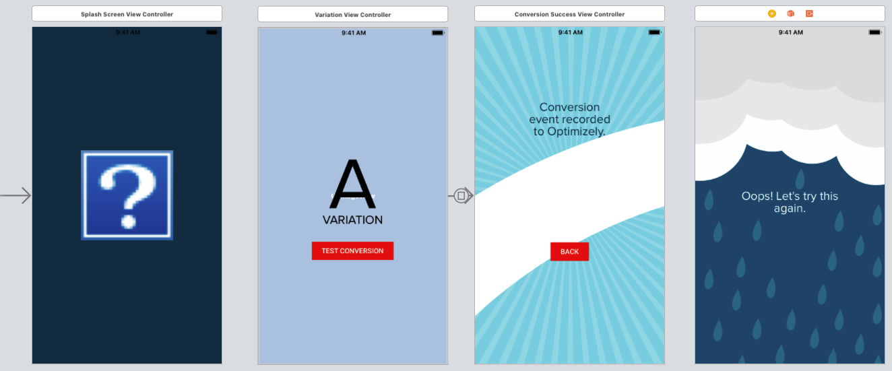

# Optimizely iOS SDK Tutorial

This tutorial enables you to quickly get started in your development efforts to create an iOS app with the Optimizely X iOS SDK. The Objective-C SDK package includes a Demo App project that performs an A/B test and tracks an experiment.



The Demo App works as follows:
* When the app is launched the `applicationDidFinishLaunching` method of `AppDelegate` instantiates a number of Optimizely objects, including an `OPTLYManagerBuilder` it uses to create an `OPTLYManager`.
* `applicationDidFinishLaunching` then uses the `OPTLYManager` to instantiate an `OPTLYClient` by asynchronously fetching the datafile.
* Once the datafile is fetched and the Optimizely client is started, `activate` is invoked to activate an experiment named `background_experiment`. This buckets the user, sends an impression event, and returns a reference to an `OPTLYVariation`. 
* Before the method completes, it invokes the class's `setRootViewController` helper method to configure and set the root controller to `OPTLYVariationViewController`, including the assignment of the bucketed variation returned from `activate` to the controller's `variationKey` member, as well as an event key to the controller's `eventKey` member. The `Variation View Controller scene` is the corresponding scene in the storyboard for this controller.
* When the `Variation View Controller scene` is displayed, the controller's `viewDidLoad` method prepares a background image and text based on the `variationKey` for either Variation A or B.
* The scene contains a button called **TEST CONVERSION** that has been configured to invoke the controller's `attemptTrackAndShowSuccessOrFailure` event handler when clicked. The event handler invokes the Optimizely client's `track` method and sends a conversion event for the event named `sample_conversion` stored in the `eventKey` member.


## Prerequisites
* Xcode 10.+
* A Github account configured with [SSH keys](https://help.github.com/articles/connecting-to-github-with-ssh/)

## Quick start
This section shows you how to prepare, build, and run the sample application using Xcode.

1. Clone or download the **objective-c-sdk** package.
2. Run Xcode.
3. Select **Open another project** from Xcode's splash screen.
4. Navigate to the location where you downloaded the **objective-c-sdk** package in Step 1 and click **Open**.
5. Select **Product** > **Build**.
6. Expand the **OptimizelyDemoApp** sub project in the Project navigator.
7. Open **AppDelegate.swift**.
8. Place a breakpoint on the following line within the **applicationDidFinishLaunching** method:
```swift
let eventDispatcher = OPTLYEventDispatcherDefault(builder: OPTLYEventDispatcherBuilder(block:...
```
9. (Optional) Ensure an iOS device is connected and select your iOS device, or use the Simulator for the target device.
10. Select **Product** > **Run**. 
11. Verify that the break point is hit.
12. Resume program execution and verify that the Demo App appears on the target iOS device.

## How the Demo App was Created
The following subsections provide information about key aspects of the Test App and how it was put together:
* [Modules](#modules)
* [Scene Design](#scene-design)
* [User Interface and Visual Assets](#user-interface-and-visual-assets)


### Modules
The package workspace contains the following projects: 
1. **OptimizelySDK...** : Various Optimize SDK components, including:
 * **OptimizelyDemoApp**: Code and resources for the Demo App for both iOS and TVOS. Note that this tutorial only covers the iOS Demo App.
 * **OptimizelySDKiOS**: iOS-specific code for the Optimizely SDK.
 * **OptimielySDKUniversal**, **OptimielySDKCore**: Core Optimizely SDK classes and interfaces.
 * **OptimizelyDatafileManager**: Handles the downloading and caching of the configuration datafile. The Optimizely Objective-C SDK core uses a default implementation provided in this module called `OPTLYDatafileManagerDefault`.
 * **OptimizelySDKEventDispatcher**: handles dispatching events to the Optimizely backend using a service so that events can be sent without the app being re-opened. Events are persisted in a SQLite3 database. The Optimizely Objective-C SDK core uses a default implementation provided in this module called `OPTLYEventDispatcherDefault`
2. **Pods** : Third-party dependencies.

For details about the APIs used to develop this sample, see the [documentation](https://docs.developers.optimizely.com/full-stack/docs).

### Scene Design
The following scenes are defined in **/OptimizelyDemoApp/OptimizelyiOSDemoApp/iOSMain.storyBoard**:


|Component                        |Description                                                                                                                                 |
|---------------------------------|--------------------------------------------------------------------------------------------------------------------------------------------|
|`Splash Screen View Controller`       |The screen that is displayed during launch.|
|`Failure View Controller Scene`       |The screen that is displayed when the impression cannot be sent (e.g. due to a network failure).|
|`Variation View Controller Scene`       |The screen with the **TEST CONVERSION** button for a given variation.|
|`Conversion Success View Controller Scene`       |The screen that is displayed when the impression is successfully sent to Optimizely. The screen includes a **BACK** button that returns the user to the **Variation View Controller Scene** to invoke another impression.|

### User Interface and Visual Assets
The **/OptimizelyDemoApp/OptimizelyiOSDemoApp/Assets.xcassets** directory contains the following imagesets:

|Asset                   |Description                                                                                        |
|------------------------|---------------------------------------------------------------------------------------------------|
|`AppIcon`|The app's main icon.|
|`background_confirmation`|The background to display in the `Conversion Success View Controller Scene` when the impression is successfully sent to Optimizely.|
|`background_error`|The background to display in the `Failure View Controller Scene` when the impression is not successfully sent to Optimizely.|
|`background_variA`|The background to display in the `Variation View Controller Scene` when Variation A is selected.|
|`background_variB-marina`|The background to display in the `Variation View Controller Scene` when Variation B is selected.|
|`LaunchImage`|The background to display in the `Splash Screen View Controller Scene` during launch.|
|`LaunchImage`|The app's logo.|

The **/OptimizelyDemoApp/Resources** directory contains the following assets:

|Asset                   |Description                                                                                        |
|------------------------|---------------------------------------------------------------------------------------------------|
|`.otf` and `.ttf` files|Contains font glyphs used by the App.|
|`demoTestDatafile.json`|Contains example experimentation data.|

## Configure Resources
To configure A/B tests:
* [Prepare Members](#prepare-members)
* [Create the Handlers](#create-the-handlers)
* [Create the Manager Instance](#create-the-manager-instance)
* [Initialize the Manager](#initialize-the-manager)

The code samples in the following subsections are in **/OptimizelyDemoApp/AppDelegate.swift** and **/OptimizelyDemoApp/OPTLYVariationViewController.swift**.

### Prepare Members
The main application class (`AppDelegate`) declares members for an Optmizely client, user ID, and the settings required by the client:
```swift
class AppDelegate: UIResponder, UIApplicationDelegate {

    ...
    // generate random user ID on each app load
    let userId = String(Int(arc4random_uniform(300000)))
    
    // customizable settings
    let datafileName = "demoTestDatafile" // default parameter for initializing Optimizely from saved datafile
    var projectId = "11093712109" // project name: X Mobile - Sample App
    var experimentKey = "background_experiment"
    var eventKey = "sample_conversion"
    let attributes = ["sample_attribute_key":"sample_attribute_value"]
    let eventDispatcherDispatchInterval = 1000
    let datafileManagerDownloadInterval = 20000  
    ...    
}
```

### Create the Handlers
The `applicationDidFinishLaunching` method in `AppDelegate` instantiates an event dispatcher to handle impression events, and a datafile manager to handle the loading and management of the data file:
```swift
func applicationDidFinishLaunching(_ application: UIApplication) {
    // ---- Create the Event Dispatcher ----
    let eventDispatcher = OPTLYEventDispatcherDefault(builder: OPTLYEventDispatcherBuilder(block: { (builder) in
        builder?.eventDispatcherDispatchInterval = self.eventDispatcherDispatchInterval
        builder?.logger = OPTLYLoggerDefault.init(logLevel: .debug)
    }))
    
    // ---- Create the Datafile Manager ----
    let datafileManager = OPTLYDatafileManagerDefault(builder: OPTLYDatafileManagerBuilder(block: { (builder) in
        // builder!.datafileFetchInterval = TimeInterval(self.datafileManagerDownloadInterval)
        builder!.datafileConfig = OPTLYDatafileConfig(projectId: nil, withSDKKey:"FCnSegiEkRry9rhVMroit4")!;
        
    }))
}
```

The event handler sets up the event dispatch interval and assigns a logger to use for logging events. The datafile manager instantiates an `OPTLYDatafileConfig` that the builder will use to manage the sample datafile.

### Create the Manager Instance
The `applicationDidFinishLaunching` method then creates an `OptlyManagerBuilder` object, passing in the SDK key, and the event handler and datafile manager described above:

```swift
func applicationDidFinishLaunching(_ application: UIApplication) {
    ...
    let builder = OPTLYManagerBuilder(block: { (builder) in
        builder!.projectId = nil;
        builder!.sdkKey = "FCnSegiEkRry9rhVMroit4"
        builder!.datafileManager = datafileManager!
        builder!.eventDispatcher = eventDispatcher
    })
    ...
}
```

The `applicationDidFinishLaunching` method uses the builder to create an `OptimizelyManager` object and sets up a reference in the manager to the `OPTLYDatafileConfig` stored in the datafile manager:
```swift
func applicationDidFinishLaunching(_ application: UIApplication) {
  ...
  var optimizelyManager = OPTLYManager(builder: builder)
        
  optimizelyManager?.datafileConfig = datafileManager?.datafileConfig
  ...
}
```

### Initialize the Manager
The `applicationDidFinishLaunching` method now has everything in place to start using Optimizely. It invokes the `initialize` method on the Optimizely manager to start asynchronous initialization, passing in a callback that will be invoked when the datafile has been read:

```swift
func applicationDidFinishLaunching(_ application: UIApplication) {
  ...
    optimizelyManager?.initialize(callback: { [weak self] (error, optimizelyClient) in
        optimizelyClient?.optimizely?.notificationCenter?.addActivateNotificationListener({ (experiment, userId, attributes, variation, event) in
            //Handle activation event. In the demo app, the parameter values received are used third party libraries
        })
        
        optimizelyClient?.optimizely?.notificationCenter?.addTrackNotificationListener({ (eventKey, userId, attributes, eventTags, event) in
            //Handle a track event. The demo app tags custom events with attributes
        })
        ...
        let variation = optimizelyClient?.activate((self?.experimentKey)!, userId: (self?.userId)!, attributes: (self?.attributes))
        
        self?.setRootViewController(optimizelyClient: optimizelyClient, bucketedVariation:variation)
    })

  ...
}
```

The callback adds listeners for activate and track events, both of which pass the values received to third-party libraries for analysis. 

## Functionality
* [Perform an A/B Test](#perform-an-a-b-test)
* [Track the Experiment](#track-the-experiment)

### Perform an A/B Test
The `applicationDidFinishLaunching` callback invokes `activate` to start an experiment and receives back a variation. It then uses the class' `setRootViewController` helper method to start the storyboard, passing in the variation that will be used by the various scenes in the storyboard:

```swift
```swift
func applicationDidFinishLaunching(_ application: UIApplication) {
  ...
    optimizelyManager?.initialize(callback: { [weak self] (error, optimizelyClient) in
        ...
        let variation = optimizelyClient?.activate((self?.experimentKey)!, userId: (self?.userId)!, attributes: (self?.attributes))
        
        self?.setRootViewController(optimizelyClient: optimizelyClient, bucketedVariation:variation)
    })

  ...
}
```

`setRootViewController` instantiates an `OPTLYVariationViewController` passing the event, Optimizely client, user ID, and the variation key from the Variation received:
```swift
func applicationDidFinishLaunching(_ application: UIApplication) {
    func setRootViewController(optimizelyClient: OPTLYClient!, bucketedVariation:OPTLYVariation?) {
        DispatchQueue.main.async {
            ...            
            if (bucketedVariation != nil) {
                // load variation page
                if let variationViewController = storyboard.instantiateViewController(withIdentifier: "OPTLYVariationViewController") as? OPTLYVariationViewController
                {
                    variationViewController.eventKey = self.eventKey
                    variationViewController.optimizelyClient = optimizelyClient
                    variationViewController.userId = self.userId
                    variationViewController.variationKey = bucketedVariation!.variationKey
                    rootViewController = variationViewController
                }
            }
            ...
        }
    }
}
```

When `OPTLYVariationViewController` is displayed, it renders the appropriate text and background for either Variation A or B depending on the Variation key received:
```swift
class OPTLYVariationViewController: UIViewController {
    override func viewDidLoad() {
        ...

        switch self.variationKey {
            case "variation_a":
              //set up UI elements for Variation A
            case "variation_b":
              //set up UI elements for Variation B
            default:
                break
        }      
    }
}
```

### Track the Experiment
The `OPTLYVariationViewController` class contains a method called `attemptTrackAndShowSuccessOrFailure` that invokes `track` on the Optimizely Client for the event and user:

```swift
class OPTLYVariationViewController: UIViewController {

    @IBAction func attemptTrackAndShowSuccessOrFailure(_ sender: Any) {
        self.optimizelyClient?.track(self.eventKey, userId: userId)
        //Segue to the success scene...
    }
}
```

This method has been assigned as the `on-click` handler for the **TEST CONVERSION** button in the scene. The [Track](https://docs.developers.optimizely.com/full-stack/docs/track) method tracks events across the experiment. At the end of the event handler, a segue is performed to inform the user that the test has successfully started.
